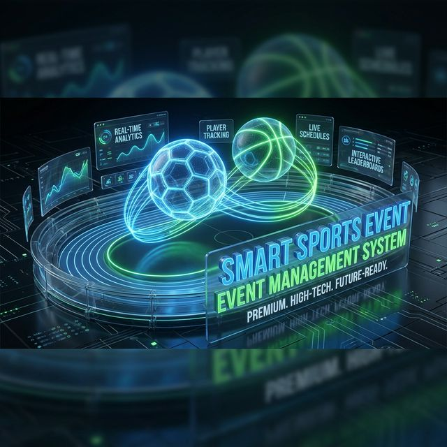

# 🏆 Smart Sports Event Management System

## 🌟 Overview

The **Smart Sports Event Management System** is a next-generation platform designed to streamline the organization, tracking, and management of modern athletic events. Built with a focus on real-time analytics and high-performance user interfaces, it empowers organizers and athletes with a data-driven experience.

### 🚀 Key Features

- **Real-time Event Tracking**: Monitor live games and athlete performance with zero latency.
- **Dynamic Leaderboards**: High-fidelity 3D-styled visual scoreboards.
- **Comprehensive Management**: Full CRUD operations for sports, events, athletes, and schedules.
- **Modern UI/UX**: Premium, glassmorphic design system tailored for sports analytics.

---

## 🛠 Project Structure

The project follows a modular MERN architecture with full TypeScript support:

- **[backend](file:///Users/vimukthibuddika/Documents/Business/Github/Y3S2_ITPM-Smart_Sports_MS-/backend)**: Robust Node.js API with Express & Mongoose.
- **[frontend](file:///Users/vimukthibuddika/Documents/Business/Github/Y3S2_ITPM-Smart_Sports_MS-/frontend)**: Ultra-fast React application powered by Vite.

---

## 🚦 Getting Started

### Prerequisites

- **Node.js** (v18+)
- **MongoDB** (Local or Atlas Atlas URI)

### 📦 Installation

#### Backend Setup
1. `cd backend`
2. `npm install`
3. Configure `.env` (use `.env.example` as a template)
4. `npm run dev`

#### Frontend Setup
1. `cd frontend`
2. `npm install`
3. Configure `.env`
4. `npm run dev`

---

## 🧪 Development Workflow

| Component | Dev Command | Build Command |
| :--- | :--- | :--- |
| **Backend** | `npm run dev` | `npm run build` |
| **Frontend** | `npm run dev` | `npm run build` |

---

## 💎 Premium Loading Styles

The application features custom 3D CSS animations to ensure a smooth, high-end "web loading" experience that mimics modern sports broadcasting interfaces.

---

*Developed with ❤️ for the Smart Sports Community.*
